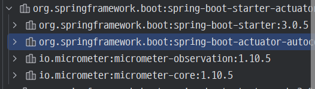
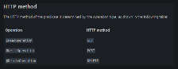
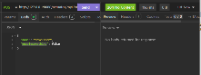

<style>
.burk {
    background-color: red;
    color: yellow;
    display:inline-block;
}
</style>


# spring boot actuator 파헤치기
[인프런 강의 바로 가기](https://www.inflearn.com/course/spring-boot-actuator-%ED%8C%8C%ED%97%A4%EC%B9%98%EA%B8%B0/dashboard)

[강의자료_tistory](https://semtul79.tistory.com)

섹션 1. 실습 프로젝트 생성 및 강의 개요 3개 ∙ (19분)
- 프로젝트 생성 08:00
- 공식 가이드 페이지, 의존성 라이브러리 11:13
- 강의 자료

섹션 2. actuator 기본 설정과 다양한 endpoint 4개 ∙ (2시간 14분)
- endpoints 설정 25:48
- custom endpoint 생성 35:40
- health endpoint 25:34
- info endpoint 47:36

섹션 3. metrics endpoint 8개 ∙ (2시간 28분)
- metrics endpoint 개요  26:35
- Counter 37:37
- metrics tags #1 17:25
- metrics tags #2 10:24
- Gauge 14:24
- Timer #1 19:16
- Timer #2 16:10
- Metrics 정리 06:38

섹션 4. spring boot admin 연동 2개 ∙ (23분)
- spring boot admin 연동 19:49
- spring boot admin 연동 #2 03:34

섹션 5. 마무리 1개 ∙ (2분)
- 마무리 02:54

## 섹션 1. 실습 프로젝트 생성 및 강의 개요
### 1.  프로젝트 생성
spring boot 3.x 기반으로 actuator 설정 및 custom metrics 추가하는 방법
- 단순히 actuator 사용법만 익히는 것이 아닌, spring boot 내 spring boot 3.x 기반으로 actuator 설정 및 custom metrics 추가하는 방법

- [강의 URL-인프런](https://www.inflearn.com/course/spring-boot-actuator-%ED%8C%8C%ED%97%A4%EC%B9%98%EA%B8%B0)

- [유프브_동영상링크](https://youtu.be/2-JXZOJkkrM)

#### project 생성

https://start.spring.io/ 에서 프로젝트를 하나 생성

- 현 시점 최신 버전인 3.0.4 를 선택
- spring boot 3.0 부터는 java 17이 최소버전

의존성에는 
- spring boot actuator 가 필수이며, 
- WEB
- H2


구동
- http://127.0.0.1:8080/actuator

- self -> http://127.0.0.1:8080/actuator
- health -> http://127.0.0.1:8080/actuator/health
- health-path -> http://127.0.0.1:8080/actuator/health/{*path}

HATEOAS
- . 발음은 / 헤이티오스/ 

### 2. 공식 가이드 페이지, 의존성 라이브러리
Hello World Study 2023. 3. 20. 23:26 

spring boot actuator 공식 레퍼런스 주소
- https://docs.spring.io/spring-boot/docs/current/reference/html/actuator.html#actuator


```xml
<dependencies>
    <dependency>
        <groupId>org.springframework.boot</groupId>
        <artifactId>spring-boot-starter-actuator</artifactId>
    </dependency>
</dependencies>

```
intellij 의 maven 의존성 부분을 보니 
- spring-boot-starter-actuator 는 내부적으로 micrometer 라이브러리를 사용하고, auto configuration을 위한 라이브러리리(spring-boot-actuator-autoconfigure)를 포함하는걸 알 수 있습니다. 

- 

- 핵심 라이브러리인 micrometer-core 의 내용을 살펴보면
  - spring boot 가 구동되는 application 의 health, info, metric 정보들을 수집하는 역할을 하는 binder 클래스들이 아주 많이 구현되어 있는걸 알수 있습니다.


 ### 3. endpoints 설정

https://youtu.be/Ap_vrMyvya8

endpoint
- 정보를 얻을수 있는 링크. 정확히는 url 을 actuator 에서는 endpoint 라고 부릅니다.
- 즉 http://localhost:8080/actuator/health <-- 이런 url 이 각각 endpoint 가 됩니다.

#### 기본 제공되는 endpoints

아래에 주요 endpoint

| 이름|적요|
| :---- | :----------------|
|beans	|등록된 bean 목록 제공 |
|caches	|cache 사용중이라면 cache 관련 정보 제공 |
|conditions	|spring auto configuration 에 의해 bean으로 등록된것과 그렇지 않은 것의 상세 이유를 제공|
|health	|application이 구동중인지, application과 연동되는 다른 서비스(DB, message queue)가 구동중인지 여부 제공|
|info	|application 의 대략적인 정보|
|metrics	|cpu, mem, thread count 등의 모니터링용 메트릭 정보|
|logger	|로거 설정 확인 실시간 로그 레벨 변경 제공 |
|quartz	|quartz 라는 스케줄링 관련 라이브러리를 사용하고 있다면, quartz 관련 정보를 상세히 제공|


더 자세한것은 아래 링크
- https://docs.spring.io/spring-boot/docs/current/reference/html/actuator.html#actuator.endpoints


#### endpoint 활성화설정, 노출 설정

endpoint 는 enable/disable (활성화 여부)과 expose ( 노출 여부 ) 라는 2가지 설정을 할 수 있으며 2가지 모두 켜진 상태여야 외부로 노출
- 즉 enable/disable 을 통해 spring boot 내부적으로 특정 endpoint 의 정보를 수집하는걸 설정할 수 있으며,
- expose 설정을 통해 최종적으로 web 이나 jmx ( = java 모니터링 관련 프로토콜/스펙) 에 해당 정보가 보이는걸(=노출) 설정

- default 설정으로 활성화된 endpoint 는 shutdown 이라는 endpoint 를 제외하고 모두 활성화

특정 endpoint 를 enable / disable 하는 방법은
- application.yml 에서 아래처럼 managment.endpoint 하위에 
- endpoint 명을 적고 enabled 에 true, false 를 지정

```yaml
management:
  endpoint:
    shutdown:
      enabled: true
    beans:
      enabled: false
    loggers:
      enabled: true
    quartz:
      enabled: false
```

spring boot assistent
- intellij 에서 spring boot assistent 라는 플러그인을 설치하면 yml 파일에 대해 자동 완성이 지원
- 철자 하나하나 외우지 않아도 쉽게 설정이 가능
- management.endpoint 도 있고 management.endpoints 도 있다

노출(expose) 설정
- 아래처럼 default 로 web과 jmx 에 대해 health 라는 endpoint 만 노출되도록 되어 있습니다.
- include는 노출에 포함할 endpoint,
- exclude 는 노출에 제외할 endpoint 라는 뜻입니다.


https://docs.spring.io/spring-boot/docs/current/reference/html/actuator.html#actuator.endpoints.exposing

노출방법은
- management.endpoints.web.exposure 하위에 include 와 exclude 에 endpoint 를 적어주면 됩니다.
```yaml
management:
  endpoints:
    web:
      exposure:
        include: "*"
        exclude: logger
```


활성화/비활성화, 노출 여부도 설정을 했으니 spring boot 재구동을 해봅시다.

- shutdown endpoint 를 명시적으로 enable 시켰기에 shutdown 항목도 보입니다. 
- logger, caches 는 노출 제외 시켰으므로 나오지 않습니다.

- auditevents 라는 endpoint 는 AuditEventRepository 타입의 bean이 등록되어 있어야 동작을 한다고 적혀있습니다.

각 endpoint 별 상세 요건은
- https://docs.spring.io/spring-boot/docs/current/reference/html/actuator.html#actuator.endpoints 에서 확인하면 됩니다.


주의할 사항은 별표(*)
- yml 에서 * 는 특별한 의미를 가지기에 * 라고 적으면 안되고 "*" 와 같이 따옴표로 묶어줘야 에러가 나지 않습니다.
- properties 에서는 * 는 특별한 의미가 아닙니다.


#### 보안 문제
actuator 를 통해 application의 다양한 정보를 확인할 수 있고 , 특정 endpoint 에서는 실시간 변경도 가능하게 해줍니다. ( e.g. thread dump )
- 보안상 문제가 있을 수 있으므로 spring security 혹은 이와 유사한 방법으로 보안 위험을 해결하도록 해야합니다.  
- 가장 쉬운 방법은 spring security 를 통해 /actuator url 에 대해 http basic auth 을 적용해서 id, pw 가 맞아야만 pass 되도록 하면 되며, 
- 본 포스팅에서는 security 설정은 다루지 않습니다. 
- ( spring security http basic auth 라고 구글링 하면 많은 정보가 나오니 참고하세요 )


#### endpoint cache
http에 etag 와 같은 캐시 방법이 존재하듯이, endpoint 에도 cache 방법이 있습

endpoint 마다 캐시값을 설정해주고 싶다면 
-  management.endpoint.<endpoint명>.cache.time-to-live 에 작성

time-to-live 는 java.time.Duration 타입
- 1s, 1ms, 10h, 20d 와 같이 값과 단위를 함께
- s -> 초, ms -> 밀리초, h -> 시간, d -> 일

```yaml
management:
  endpoint:
    beans:
      cache:
        time-to-live: 300s
```


#### CORS support
actuator 입장에서의 client 는 일반적으로는 다른 서버
- 간혹 web 화면에서 endpoint 를 호출해야 할 수도 있습
- 이 경우 client 는 web 이 되며, http 요청은 일반적으로 javascript 를 이용할겁니다.
- 웹브라우저에서는 자신의 도메인이 아닌 도메인으로 javascript 가 http 요청을 보내면 CORS 체크를 하게 되며, 서버단에 CORS 허용 설정이 없다면 http 요청이 실패

spring 의 @RestController 를 이용한 클래스라면 @CrossOrigin 어노테이션 한줄 적어주면 끝나는데, 
- actuator 에서도 뭔가 해결책이 있지 않을까요?
- cors 설정을 통해 가능

```yaml
management:
  endpoints:
    web:
      cors:
        allowed-origins: http://test.com
        allowed-methods: GET
```

## 섹션 2. actuator 기본 설정과 다양한 endpoint

### 4. custom endpoint 생성
[유프뷰강의](https://youtu.be/FoC5h1GHkKA)

custom endpoint 를 생성하는 방법

[참고로 공식 가이드는](https://docs.spring.io/spring-boot/docs/current/reference/html/actuator.html#actuator.endpoints.implementing-custom)

이번에 만들 custom endpoint 는
- application에서 참조하는 라이브러리 이름과 버전 정보
- myLibraryInfo 라는 이름의 endpoint

#### 4.1 기본 클래스 만들기
현재 app에서 사용중인 라이브러리들의 이름과 버전정보를 응답으로 리턴하는 custom endpoint 를 만들 필요가 있다고 가정해봅시다.
- getLibraryInfos() 라는 메서드에 라이브러리 정보를 가져와서 list에 저장하고 return 하는 메서드
- 실제 로딩된 라이브러리 정보 가져오는 건 강의 범위에 벗어나므로 하드코딩

```java

@Endpoint(id = "myLibraryInfo")  // endpoint id 지정. 필수!
public class MyLibraryInfoEndpoint {


    @ReadOperation    // read 요청에 대한 메서드라는 의미
    public List<LibraryInfo> getLibraryInfos() {
        // TODO: 라이브러리 정보를 읽어서 name, version을 가져오는 코드가 있어야 하나 하드코딩으로 대체함.
        LibraryInfo libraryInfo1 = new LibraryInfo();
        libraryInfo1.setName("logback");
        libraryInfo1.setVersion("1.0.0");

        LibraryInfo libraryInfo2 = new LibraryInfo();
        libraryInfo2.setName("jackson");
        libraryInfo2.setVersion("2.0.0");

        return Arrays.asList(libraryInfo1, libraryInfo2);
    }
}

```

LibraryInfo ==> DTO

```java
@Data
public class LibraryInfo {
    private String name;
    private String version;
}
```

유심히 봐야 할 부분은 아래 어노테이션입니다.
```{remark}
@Endpoint(id = "myLibraryInfo")
```

rest controller 구현시의  아래 코드 정도의 역할이라고 보면 됩니다.
```java
@RestController
@RequestMapping("/api/myLibraryInfo")
```


@Endpoint 어노테이션에서 중요한 부분
```java
@Target(ElementType.TYPE)   <-- type 즉 클래스 위에 지정 가능한 어노테이션
@Retention(RetentionPolicy.RUNTIME)
public @interface Endpoint {
    String id() default "";       <-- value()가 없고 id()만 있음.
}

```
- @Target
  - ype 으로 적혀있으므로 class 에만 지정이 가능한 어노테이션이며
  - value() 라는 필드가 없고 id() 필드만 존재하는게 특이합니다.
  - @XXX("value1")  <-- 이런식으로 어노테이션을 사용하면 value1 이라는 값이 어노테이션내의 value() 필드에 할당되는게 자바 스펙입니다.

  - @Endpoint 는 value() 필드가 없으므로 @Endpoint("myLibraryInfo") 라고 적으면 오류가 납니다.
  - 반드시 @Endpoint(id = "myLibraryInfo") 와 같이 필드명을 명확히 지정해줘야 합니다.


- @ReadOperation
  - rest controller 구현시 사용하는 아래 어노테이션과 유사
  - 즉 HTTP GET 요청, 즉 읽기 요청


마지막으로 할일은 위 클래스를 bean 으로 등록하면 됩니다.
```java
@Configuration
public class MyLibraryInfoEndpointConfig {

    @Bean
    MyLibraryInfoEndpoint myLibraryInfoEndpoint() {
        return new MyLibraryInfoEndpoint();
    }
}

```
- bean 으로 등록되는 클래스가 우리가 만든 클래스이므로 @Bean 이 아닌 @Component 을 써도 됩니다.
- 즉 위 config 클래스를 삭제하고 아래처럼 @Endpoint 가 붙은 클래스에 @Component 를 적어도 됩니다.
- 그러나 설정관련된 bean 은 일반적으로 @Configuration와 @Bean 을 이용해서 등록하며, spring boot actuator에서도 이 방식으로 endpoint 들을 bean으로 등록해주고 있으므로 가급적 @Bean 을 이용해서 등록하도록 합시다.
```java
@Component    <-- bean 등록을 위해 이걸 추가해도 됨
@Endpoint(id = "myLibraryInfo")
public class MyLibraryInfoEndpoint {
(생략)
}
```

확인
- spring boot 를 재구동한 후 actuator 에 custom endpoint 가 보이는지 확인해봅시다.
- http://127.0.0.1:8080/actuator/myLibraryInfo
- 결과
  ```text
  [
    {
      "name": "logback",
      "version": "1.0.0"
    },
    {
      "name": "jackson",
      "version": "2.0.0"
    }
  ]
  ```

#### 4.2 HTTP Method

thread dump 를 수행하라, logger level 을 debug 나 info 레벨로 변경하라. 와 같이 조회가 아닌 뭔가 수행하라는 명령을 actuator 를 통해 수행할수도 있는데 이때는 HTTP GET 이 적절해보이지 않습니다.

actuator 에서는 이런 문제를 해결하기 위해
- @WriteOperation, @DeleteOperation 이라는 추가 어노테이션이 제공
- 


#### 4.3 파라미터 수신방법
rest api 의 경우 당연히 파라미터를 수신할 수 있습니다.

spring mvc 에서는 @PathVariable, @RequestParameter, @RequestBody 와 같은 어노테이션을 통해 query string 이나 http body 의 내용을 파라미터로 수신할 수 있습니다.

endpoint 에서도 유사하게 파라미터를 수신하는 방법이 있습니다.


##### 1 - query string으로 수신하는 방법
기존 메서드에 수신하고 싶은 파라미터를 적어주면 됩
- 필수값이 아니라면 @Nullable 을 함께 적어줍니다.
- @ReadOperation 어노테이션이 붙어 있으므로 http GET 요청에 매핑되며, 
- http GET 요청에서 파라미터를 넘기는 기본 방법은 query string
- 아래처럼만 적어줘도 query string 의 값을 매핑시켜서 파라미터로 전달

```java
import org.springframework.boot.actuate.endpoint.annotation.Endpoint;
import org.springframework.boot.actuate.endpoint.annotation.ReadOperation;
import org.springframework.lang.Nullable;

import java.util.Arrays;
import java.util.List;

@Endpoint(id = "myLibraryInfo")
public class MyLibraryInfoEndpoint {
  ...
      if (name != null) {
          resultList = resultList.stream()
                  .filter(libraryInfo -> {
                      return libraryInfo.getName().equals(name);
                  })
                  .toList();
      }
      if (includeVersion == false) {
            resultList = resultList.stream()
                    .map(libraryInfo -> {
                        LibraryInfo simpleInfo = new LibraryInfo();
                        simpleInfo.setName(libraryInfo.getName());
                        // version 정보는 포함하지 않음.
                        return simpleInfo;
                    }).toList();
        }

        return resultList;
    }
}

```
기존 메서드 코드에서 if 문이 2개나 더 들어갔는데, 
- name 으로 필터링 및 includeVersion 의 true, false 에 따라 version 정보를 포함할지를 구현

- http://127.0.0.1:8080/actuator/myLibraryInfo  ==>  400 status 코드가 리턴
  - name과 includeVersion 이라는 파라미터를 적었으며, 
  - includeVersion 파라미터는 @Nullable 이 없으므로 필수 필드인데, 우린 아무런 query string 을 넣지 않았기에 400 bad request 에러를 리턴
- http://127.0.0.1:8080/actuator/myLibraryInfo?includeVersion=true
- http://127.0.0.1:8080/actuator/myLibraryInfo?includeVersion=true&name=jackson


##### 2 - body 수신방법
query string 외에 http body 의 정보를 파라미터로 수신해야 할때도 있습니다. 보통 HTTP POST 방식일때이겠죠.
- 기존 예제와 큰 차이는 없으나, 
- HTTP POST 방식으로 매핑되기 위해 **@WriteOperation** 을 사용해야 하며, 수신하고 싶은 파라미터명을 적어주면 됩니다.

  ```java
  @Slf4j
  @Endpoint(id = "myLibraryInfo")
  public class MyLibraryInfoEndpoint {
  
      @WriteOperation
      public void changeSomething(String name, boolean enableSomething) {
          log.info("name: {}, enableSomething: {}", name, enableSomething);
      }

  }
  ```
- 라이브러리 조회 endpoint 에서는 단순히 로그만 찍어서 파라미터가 잘 수신되는지만 확인

- spring mvc 로 개발시의 body 는 MemberDto, OrderDto 와 같이 DTO 클래스를 파라미터로 지정하는데, 
  - 위 예제에서는 DTO 객체가 아닌, 개별 파라미터를 하나씩 다 적어주는게 특이해 보입니다.
  - **단순한 파라미터 타입만 지원** 
  - DTO와 같이 여러 멤버변수를 가진 객체를 파라미터로 지정해주는건 지원되지 않음
 - spring mvc로 비유하자면, 입력값을 java DTO 타입으로 변환이 안되므로 simple 한 argument resolver 가 지원된다고 볼 수 있습니다.

- HTTP POST 방식으로 요청을 해야하므로 웹브라우저는 사용이 어려우며 
  - postman 이나 insomnia 와 같은 HTTP client 프로그램을 이용해서 테스트를 해야 합니다.
  - insomnia 라는 프로그램을 통해 아래처럼 json type의 body에 name 과 enableSomething 이라는 필드를 넣어줬으며 HTTP POST 로 method 를 지정
  - 
    - http://127.0.0.1:8080/actuator/myLibraryInfo
      ```json
      {
          "name": "developer",
          "enableSomething": false
      }
      ```

  - java 메서드의 리턴 타입이 void 이므로 별도의 응답 body는 없습
    - 그래서 응답 status 가 204 no content 라고 나오네요.
  - body 의 경우 DTO 로 수신할 수 없는게 다소 불편할 수 있으나, 
    - actuator 에 복잡한 DTO를 넘길일은 거의 없으니 문제는 없어 보입니다.


##### 3 - path 파라미터 수신방법
spring mvc 의 @PathVariable 에 해당하는 path 파라미터 수신
- **@Selector** 라는 path 파라미터 수신용 어노테이션을 사용
- 여기서도 로그를 통해 파라미터가 잘 들어오는지 확인만 하고, 해당 파라미터를 그대로 리턴하도록 했습니다.

```java
@ReadOperation
public String getPathVariable(@Selector String path1) {
    log.info("path1: {}", path1);
return path1;
}

```

/actuator/myLibraryInfo 하위에 myPathVar 라는 path 파라미터를 넣었습니다
- 응답에 myPathVar 라고 path 파라미터로 넣은 값이 잘 리턴되는걸 알 수 있습니다.
- "http://127.0.0.1:8080/actuator/myLibraryInfo/aaaa"


다중 path
- /actuator/myLibraryInfo/path1/path2/path3  와 같이 path가 여러개일때도 처리가 가능
- Selector 어노테이션을 내부를 보면 아래처럼 match 라는 필드가 있으며, 해당 필드는 SINGLE, ALL_REMAINING 중 하나를 넣을 수 있습니다. 
- 하이라이트한 부분을 읽어보면 알 수 있듯이 모든 path 부분을 캡쳐하고, path 구분을 위해 String[] 형태로 변환된다고 적혀있습니다.

- @Selector 의 match 기본값이 Match.SINGLE 이므로 아래처럼 파라미터 부분을 변경해주면 됩니다.

```java
@ReadOperation
public String getMultiPathVariable(@Selector(match = Selector.Match.ALL_REMAINING) String[] path) {
    log.info("path: {}", Arrays.asList(path));
return Arrays.asList(path).toString();
}
```
- path1/path2/path3.... 처럼 path를 여러개 넣어서 테스트해보니 입력받은 path 파라미터가 잘 수신되는걸 알 수 있습니다.


주의할 부분은 
- ALL_REMAINING 과 SINGLE 를 사용한 메서드를 각각 생성해 버리면,  
- path 갯수에 상관없이 ALL_REMAINING 메서드만 호출
- 어느 메서드가 호출되는지 애매하고 외우기도 어려우니 Endpoint 당 @Selector 는 한개만 사용

#### web , jmx 선택
@Endpoint는 web 과 jmx 둘다 지원해주는 endpoint
- 만약 web 용으로만 endpoint 를 만들고 싶다면 @WebEndpoint 를 이용
- 오직 HTTP 에만 노출되게 해줍니다.
  ```java
  @Target({ElementType.TYPE})
  @Retention(RetentionPolicy.RUNTIME)
  @Documented
  @Endpoint
  @FilteredEndpoint(WebEndpointFilter.class)
  public @interface WebEndpoint {
      @AliasFor(
          annotation = Endpoint.class
      )
      String id();
  
      @AliasFor(
          annotation = Endpoint.class
      )
      boolean enableByDefault() default true;
  }
  ```
jmx 용으로만 endpoint 를 만들고 싶다면 당연히 @JmxEndpoint 를 이용하면 됩니다.
- 종적으로 노출되는건 yml 에서 exposure.include 에 적힌 endpoint 가 외부로 노출
- 모든 조건이 만족되어야 외부로 노출됩니다.

#### rest controller 와 다를게 없음
endpoint 들은 
- @RestController 어노테이션을 이용해서 우리가 자주 만들던 rest controller 와 다를게 없습
- url 에 맞게 메서드 매핑을 해주고 json을 리턴하면 되니까요

공식가이드에서도 @RestControllerEndpoint 라는 어노테이션을 이용하면 일반적인 rest controller 구현하듯이 @GetMapping , @PostMapping 등을 써서 endpoint 를 만들수 있다고 합
- 다만 호환성을 위한 비용이 발생할 수 있으니 특별한 이유가 아니면 @EndPoint 나 @WebEndpoint 를 이용해서 구현하라고 권장

- DispatcherServlet -> controller 순으로 http 요청이 흘러가니 controller 앞단인 서블릿으로도 구현할 수 있지 않을까? 생각할 수 있습니다.

- @ServletEndpoint 를 이용해서 구현할 수 있으나 동일하게 호환성을 위한 비용이 발생할 수 있으니 가급적 @Endpoint 를 이용하라고 권장하고 있습니다.

- 권장하는 방법이 아니므로 저도 위 방법대로 해본적이 없고 굳이 예제로 제공할 필요도 없어보입니다.


#### 마무리

"결국 rest controller 를 만들면 되는거니 굳이 actuator 가 아닌 직접 rest controller 만들면 되지 않나? " 라고 생각할 수도 있습니다. 
- 그러나 직접 rest controller 로 만들어버리면, prometheus 와 같은  actuator 와 호환이 되는 여러 라이브러리와 연동이 될수 없습
- actuator 가 일종의 인터페이스 역할이므로 다른 라이브러리와의 연동을 위해 actuator 를 이용하는게 좋습니다.


custom endpoint 관련 전체 소스코드
- https://github.com/ChunGeun-Yu/spring-actuator-study/tree/customEndpoint


다음에는 actuator가 제공하는 endpoint 중 health endpoint 에 대해 알아보겠습니다.


아~ 이제 머리가 좀 아프네. 쉬었다 하자... 라고 생각하고 있나요? 이러면 결국 안본다는거 잘 알잖아요. 화이팅!

### 5. about health endpoint

actuator 에서 기본 제공하는 endpoint 중 모니터링 시스템과 자주 연동될 endpoint 로 health endpoint
- application의 health 정보를 제공합니다.

#### default health endpoint
application.yml 에 아래 설정만  한 상태에서 spring boot 를 구동해봅시다.

```yaml
management:
  endpoints:
    web:
      exposure:
        include: "*"
```

```text
http://127.0.0.1:8080/actuator/health

{"status":"UP"}
```
- application이 구동중이라는 의미의 status: UP

#### show-components , show-details
눈에 띄는게 show-components 와 show-details 필드입니다. 우선 show-components: ALWAYS 로 설정 후 spring boot 재구동해봅시다.

```yaml
management:
  endpoints:
    web:
      exposure:
        include: "*"
  endpoint:
    health:
      show-components: ALWAYS
```

show-components 설정을 했더니 아래처럼 components 필드에 disk 와 ping 의 health 상태가 추가
```text
{
  "status": "UP",
  "components": {
    "diskSpace": {
      "status": "UP"
    },
    "ping": {
      "status": "UP"
    }
  }
}
```


show-components 대신에 show-details 설정을 아래와 같이 해보겠습니다.
```yaml
management:
  endpoints:
    web:
      exposure:
        include: "*"
  endpoint:
    health:
      show-details: ALWAYS
```

다시 health endpoint 를 확인해보면 아래처럼 components 내의 diskSpace 항목에 details 항목이 추가되었고 total, free 등의 상세 정보가 더 보입니다.
- show-details 는 details 필드에 상세 정보를 보여주는 설정입니다.
```text
{
  "status": "UP",
  "components": {
    "diskSpace": {
      "status": "UP",
      "details": {
        "total": 1572863995904,
        "free": 146222624768,
        "threshold": 10485760,
        "path": "D:\\2023-CKA-workspace\\SpringActuator\\spring-actuator-study\\.",
        "exists": true
      }
    },
    "ping": {
      "status": "UP"
    }
  }
}
```

#### 기본 제공해주는 health 정보들
spring boot는 auto configuration에 
- 많은 health 정보들을 기본 제공해주고 있습니다. (너무 많아서 화면 캡쳐는 앞부분만 했습니다. )
- 위 예제에서는 diskspace 와 ping 밖에 안보여지는 이유는 cassandra, couchbase 등을 사용하지 않으니 health 정보를 보여줄게 없기 때문입니다.
- https://docs.spring.io/spring-boot/docs/current/reference/html/actuator.html#actuator.endpoints.health.auto-configured-health-indicators

##### 기본 제공되는 health 정보가 활성화 되기 위한 조건
DB health 정보가 보이기 위해서는 DB를 사용해야 합
- pom.xml 에 아래처럼 h2 DB 및 JPA 의존성추가
- DB관련 의존성만 넣으면 되는것이니 mysql, oracle 의존성을 넣어도 되며, JPA 대신 mybatis 를 넣어도 됩니다.

```xml
<dependency>
	<groupId>com.h2database</groupId>
	<artifactId>h2</artifactId>
	<scope>runtime</scope>
</dependency>

<dependency>
	<groupId>org.springframework.boot</groupId>
	<artifactId>spring-boot-starter-data-jpa</artifactId>
</dependency>
```
- spring boot auto configuration에 의해 h2 DB와 연결됩니다.
  - application 이 DB와 연결이 되었습니다.

- health endpoint 를 확인해보면 아래처럼 db 라는 필드가 보이고 상세정보에 H2 DB 라는 정보가 보입니다.
```text
{
  "status": "UP",
  "components": {
    "db": {
      "status": "UP",
      "details": {
        "database": "H2",
        "validationQuery": "isValid()"
      }
    },
    "diskSpace": {
      "status": "UP",
      "details": {
        "total": 401513377792,
        "free": 111070515200,
        "threshold": 10485760,
        "path": "D:\\2023-CKA-workspace\\SpringActuator\\spring-actuator-study\\.",
        "exists": true
      }
    },
    "ping": {
      "status": "UP"
    }
  }
}
```

##### about HealthIndicator , custom HealthIndicator 만들기
health 정보 제공하는 실제 클래스명입니다.
- https://docs.spring.io/spring-boot/docs/current/reference/html/actuator.html#actuator.endpoints.health.auto-configured-health-indicators

기본 제공되는 클래스중 하나인 `DataSourceHealthIndicator` 의 내부구조
- 상속을 하고 있어 다소 복잡해보이나 결국 HealthIndicator 라는 인터페이스를 구현한 클래스입니다.


HealthIndicator 인터페이스의 중요한 부분만 발췌하면 아래와 같습니다.

- `health` 라는 메서드를 각자 구현해야 하고, getHealth()  메서드는 details 정보를 응답에 포함할지 여부만 제공하는 default 메서드 입니다.
```java
public interface HealthIndicator extends HealthContributor {

	default Health getHealth(boolean includeDetails) {
		Health health = health();
		return includeDetails ? health : health.withoutDetails();  <-- details 정보 포함여부 기능 제공
	}

	Health health();  <-- 여길 각 클래스에서 구현해야함.
}

```
아래처럼 나만의 custom health indicator 를 구현해봤습니다.
- 학습용도이니 단순히 현재 시간을 기준으로 up ,down 을 판단하고 그에 맞게 detail 정보를 다르게 설정해서 리턴하도록 만들었습니다.
- 실무에서는 application이 정상 구동되기 위해 필요로 하는(=의존하는) 서비스와 잘 연결되어 있는지를 구현하고 UP, DOWN 을 리턴하도록 하면 됩니다.

- withDetail() 메서드에 key, value를 넣어주면, 응답 json 의 detail 필드에 key, value 가 들어가는 것만 기억해주세요. Health 클래스가 상당히 직관적으로 만들어져 있어서 별도 주석이 없어도 의미를 파악할 수 있어 보입니다.

```java
@Component
public class MyCustomHealthIndicator implements HealthIndicator {
    @Override
    public Health health() {
        boolean status = getStatus();
        if ( status ) {
            Health upHealth = Health.up()
                    .withDetail("key1", "value1")
                    .withDetail("key2", "value2")
                    .build();
            return upHealth;
        }
        Health downHealth = Health.down()
                .withDetail("key3", "value3")
                .withDetail("key4", "value4")
                .build();
        return downHealth;
    }

    boolean getStatus() {
        // 현재시각이 짝수,홀수인지에 따라 up, down을 판단하는 것으로 대체
        if ( System.currentTimeMillis() % 2 == 0 )
            return true;
        return false;
    }
}
```

- 이제 spring boot 재구동한 후 health endpoint 를 확인해봅시다.

```text
http://127.0.0.1:8080/actuator/health

{
  "status": "UP",
  "components": {
    "db": {
      "status": "UP",
      "details": {
        "database": "H2",
        "validationQuery": "isValid()"
      }
    },
    "diskSpace": {
      "status": "UP",
      "details": {
        "total": 401513377792,
        "free": 111070175232,
        "threshold": 10485760,
        "path": "D:\\2023-CKA-workspace\\SpringActuator\\spring-actuator-study\\.",
        "exists": true
      }
    },
    "myCustom": {
      "status": "UP",
      "details": {
        "key1": "value1",
        "key2": "value2"
      }
    },
    "ping": {
      "status": "UP"
    }
  }
}
```
- myCustom 이라는 필드가 추가되었으며, 랜덤하게 up, down 으로 상태가 바뀝니다.

- 최상단의 status 는 모든 components 의 status가 모두 UP 일때만 UP 으로 표시됩니다.

#### status 종류
status: UP 혹은 status: DOWN 만 다루어 봤습니다.

- 그외에는 아래처럼 몇가지 상태 값이 더 있으며 각 상태별로 http response status 값도 알 수 있습니다.
- 상태값을 추가하거나 http response status 값을 굳이(!) 변경하고 싶다면 아래 그림의 링크에 자세히 나와있으니 참고하세요. 


- https://docs.spring.io/spring-boot/docs/current/reference/html/actuator.html#actuator.endpoints.health.writing-custom-health-indicators


- 실제 코드에서도 아래처럼 Health. 을 누르면 up, down, outOfService, unknown 이 나오기에 위 상태값을 굳이 외울 이유는 없어보입니다.


      

### 6. about info endpoint
https://youtu.be/OxXLOLVkXnU

#### 기본 제공 info endpoint
이름 그대로 정보성 endpoint 인데, spring boot 에서는 아래 5가지를 기본 제공

- 우선 prerequisites 즉 선결조건이 있는게 build 와 git
  - 선결조건인 info.properties 나 git.properties 파일이 없다면 disable 된다고 봐야 하며, 
  - 나머지 3가지는 기본이 disable 되어 있습니다. 
  - 결국 별도 설정을 하지 않으면 info endpoint 는 아무런 값을 보여주지 않습니다.
  - https://docs.spring.io/spring-boot/docs/current/reference/html/actuator.html#actuator.endpoints.info.auto-configured-info-contributors
- application.yml 에 아래처럼 web endpoint 만 모두 열어두고 spring boot 구동해봅시다.

```yaml
management:
  endpoints:
    web:
      exposure:
        include: "*"
```

- /actuator 에 info 항목이 보이긴 하지만, 막상 해당 endpoint 로 들어가면 비어있는 json 만 응답되는걸 알 수 있습니다.
```text
http://127.0.0.1:8080/actuator/info

{

}
```

application.yml 내에 management.info 아래에 각 항목별로 enable, disable 을 설정할 수 있습니다.
```text
  info:
    build:
      enabled: true
    env:
      enabled: true
    git:
      enabled: true
    java:
      enabled: true
```


아래처럼 management.info 하위에 os, java, env 에 대해 enabled: true 로 설정을 해주고 spring boot 를 재구동하겠습니다.

```yaml
  endpoints:
    web:
      exposure:
        include: "*"
  info:
    os:
      enabled: true
    java:
      enabled: true
    env:
      enabled: true
```
- java 와 os 정보가 상세히 나옵니다.
```json
{
  "java": {
    "version": "17.0.2",
    "vendor": {
      "name": "Oracle Corporation"
    },
    "runtime": {
      "name": "Java(TM) SE Runtime Environment",
      "version": "17.0.2+8-LTS-86"
    },
    "jvm": {
      "name": "Java HotSpot(TM) 64-Bit Server VM",
      "vendor": "Oracle Corporation",
      "version": "17.0.2+8-LTS-86"
    }
  },
  "os": {
    "name": "Windows 10",
    "version": "10.0",
    "arch": "amd64"
  }
}
``` 


#### info endpoint 내의 env 설정
env 는 왜 보이지 않을까요?
- 아래처럼 info. 으로 시작하는 환경변수를 노출해준다고 가이드에 적혀있습니다.
- https://docs.spring.io/spring-boot/docs/current/reference/html/actuator.html#actuator.endpoints.info.auto-configured-info-contributors
- 아래처럼 application.yml 파일에 key: value 형태로 값을 적어주면 spring 에서는 환경변수로 인식을 합니다.

```yaml
info:
  my-app:
    any-value: someValue
    group-id: "@project.groupId@"
    artifact-id: "@project.artifactId@"
    encoding: "@project.build.sourceEncoding@"
    java:
      version: "@java.version@"
  made-by: developerY
```

- @xxx.xxx@ 와 같이 특이한 형태가 있는데, 이건 maven 의 properties 에 해당하는 값을 읽어올때 사용하는 특수 문법 정도로 생각하면 됩니다. ( gradle 의 경우 ${xxx.xxx} 와 같은 형식입니다. )

- 아래는 현재 pom.xml 의 일부 내용인데 <java.version> 에 17이 들어가 있으며, groupId 와 artifactId 에 특정 값이 들어가 있습니다. 이런식으로 pom.xml 의 내용을 actuator info endpoint 에 노출시키고 싶으면 @xxx.xxx@ 와 같이 적어주면 됩니다.
 ```xml
	<groupId>me.developery</groupId>                    <--- 
	<artifactId>actuator-study</artifactId>             <--- 
	<version>0.0.1-SNAPSHOT</version>
	<name>actuator-study</name>
	<description>Demo project for Spring Boot</description>
	<properties>
		<java.version>17</java.version>                 <--- 
	</properties>
```
- 실행결과
  - 기존 java 와 os 가 보이고, 추가적으로 application.yml 의 info 하위에 적은 my-app 과 made-by 가 보입니다. 
  - env 라는 필드 하위에 my-app, made-by 가 들어가는게 아니니 주의하세요.

```json
{
  "my-app": {
    "any-value": "someValue",
    "group-id": "me.developery",
    "artifact-id": "actuator-study",
    "encoding": "UTF-8",
    "java": {
      "version": "17.0.2"
    }
  },
  "made-by": "developerY",
  "java": {
    "version": "17.0.2",
    "vendor": {
      "name": "Oracle Corporation"
    },
    "runtime": {
      "name": "Java(TM) SE Runtime Environment",
      "version": "17.0.2+8-LTS-86"
    },
    "jvm": {
      "name": "Java HotSpot(TM) 64-Bit Server VM",
      "vendor": "Oracle Corporation",
      "version": "17.0.2+8-LTS-86"
    }
  },
  "os": {
    "name": "Windows 10",
    "version": "10.0",
    "arch": "amd64"
  }
}
```

- @xx.xx@ 형식은 actuator 전용이 아닙
  - build time 에 maven 이나 gradle 의 속성값을  application.yml 에 넣어줄 수 있습니다. 
  - application.yml에 넣어주면 환경변수로 인식이 되므로 결국, maven , gradle 속성값을 환경변수로 사용할 수있다는 뜻입니다.
  - build 툴인 maven 과 gradle 에 따라 설정이 다르므로, 각각의 상세한 예시와 설명은 아래 공식 가이드를 참고해주세요.

    - https://docs.spring.io/spring-boot/docs/current/reference/html/howto.html#howto.properties-and-configuration.expand-properties.maven
    - https://docs.spring.io/spring-boot/docs/current/reference/html/howto.html#howto.properties-and-configuration.expand-properties.gradle


#### env endpoint ( /actuator/env   VS  /actuator/info )

조심할 부분은 아래처럼 actuator 에 env 라는 endpoint 가 제공되고 있으며, 여기에는 Environment 클래스(=환경변수 저장 클래스)내의 정보 즉 모든 환경변수값을 노출해 주고 있습니다.

- /actuator/env 에 들어가면 info. 로 시작하는 환경변수도 보여집니다.
  - 즉 info. 로 시작하는 환경변수는 /actuator/env 에도 보여지며, /actuator/info 에도 보여집니다.

```json
http://127.0.0.1:8080/actuator/env

...
"management.info.env.enabled": {
"value": "******",
"origin": "class path resource [application.yml] - 19:16"
},
"info.my-app.any-value": {
"value": "******",
"origin": "class path resource [application.yml] - 24:16"
},
"info.my-app.group-id": {
"value": "******",
"origin": "class path resource [application.yml] - 25:15"
},
"info.my-app.artifact-id": {
"value": "******",
"origin": "class path resource [application.yml] - 26:18"
},
"info.my-app.encoding": {
"value": "******",
"origin": "class path resource [application.yml] - 27:15"
},
"info.my-app.java.version": {
"value": "******",
"origin": "class path resource [application.yml] - 29:16"
},
"info.made-by": {
"value": "******",
"o

```

#### git info
spring boot 가 자동구성으로 제공하는 info 정보중 git info 에 대해 알아보겠습니다. 

- prerequisites 즉 선결조건:  git.properties 파일


플러그인 설정:
```xml
<build>
    <plugins>
        <plugin>
            <groupId>io.github.git-commit-id</groupId>
            <artifactId>git-commit-id-maven-plugin</artifactId>
        </plugin>
    </plugins>
</build>
```
- https://docs.spring.io/spring-boot/docs/current/reference/html/howto.html#howto.build.generate-git-info


- 아래처럼 git설정을 보니 mode 가 있고 기본값이 simple 로 되어 있습니다.
  - full 로 설정한 후 다시 info endpoint 를 확인해보면 git 관련 상세정보가 보이는걸 알 수있습니다. 
  - 이렇듯 뭔가 보여지는 값이 부족하다 싶으면 application.yml 에 해당 설정을 찾아보면 됩니다.  ( 물론 공식가이드에도 적혀있습니다.)


git 정보 설정:
```yaml
management:
  info:
    git:
      mode: "full"
```
- https://docs.spring.io/spring-boot/docs/current/reference/html/actuator.html#actuator.endpoints.info.git-commit-information
- http://127.0.0.1:8080/actuator/info
```json
  "git": {
"local": {
"branch": {
"ahead": "0",
"behind": "0"
}
},
"commit": {
"id": {
"describe-short": "1c3055d-dirty",
"abbrev": "1c3055d",
"full": "1c3055d582bcccb6d6cc803b64b2143de60af1e8",
"describe": "1c3055d-dirty"
},
"message": {
"short": "강의정리 Actuator",
"full": "강의정리 Actuator"
},
"user": {
"name": "김흥기",
"email": "jcscom13@gmail.com"
},
```
- 로컬 개발이 아닌 개발서버, 운영서버에 구동중인 application이 생각과 다르게 동작할때, 이게 어떤 git commit까지 반영된건지, branch가 어떤건지를  actuator 를 통해 확인할 수 있으므로 운영에 좋은 정보로 보입니다. 
  - git commit id 까지 보이기에 상당한 민감정보로 생각할 수 있는데 security 와 유사한걸 적용하면 문제 없어보입니다.

#### build info

pom.xml 에 plugin
-  https://docs.spring.io/spring-boot/docs/3.0.4/reference/html/howto.html#howto.build.generate-info )
```yaml
<build>
    <plugins>
        <plugin>
            <groupId>org.springframework.boot</groupId>
            <artifactId>spring-boot-maven-plugin</artifactId>
            <version>3.0.4</version>    <-- 자신의 spring boot 버전에 맞게 설정 필요. spring-boot-starter-parent 에 의해 version을 상속받기에 version을 적지 않는걸 권장
            <executions>
                <execution>
                    <goals>
                        <goal>build-info</goal>
                    </goals>
                </execution>
            </executions>
        </plugin>
    </plugins>
</build>
```

- https://docs.spring.io/spring-boot/docs/current/reference/html/actuator.html#actuator.endpoints.info.build-information

- https://docs.spring.io/spring-boot/docs/current/reference/html/howto.html#howto.build.generate-info

- 이 후 maven install 등을 수행하면 META-INF 디렉토리 밑에 build-info.properties 가 생성된걸 알 수 있습니다.
   
- http://127.0.0.1:8080/actuator/info
```json
  "build": {
    "artifact": "actuator-study",
    "name": "actuator-study",
    "time": "2025-03-09T06:10:02.371Z",
    "version": "0.0.1-SNAPSHOT",
    "group": "me.developery"
  }
```

#### custom info endpoint

 `InfoContributor` 인터페이스를 구현한걸 bean 으로 등록하면 된다고 가이드 되고 있습니다.
- https://docs.spring.io/spring-boot/docs/current/reference/html/actuator.html#actuator.endpoints.info.writing-custom-info-contributors

- 우선 앞서 살펴본 git 정보 제공 클래스가 어떻게 만들어졌는지 살펴봅시다.

- 단순 테스트이므로 map 에 하드코딩으로 key1, key2 와 같이 넣었는데, 실제 업무에서는 다른 bean을 참조하여 필요한 정보를 가져온 후 map 에 넣어주면 됩니다. bean으로 등록되어야 하므로 @Component 도 적어줍시다.
  
```java

```
@Component
public class MyCustomInfoContributor implements InfoContributor {
@Override
public void contribute(Info.Builder builder) {
HashMap<String, String> map = new HashMap<>();
map.put("key1", "value1");
map.put("key2", "value2");

        builder.withDetail("myCustomInfo", map);
    }
}
아래처럼 위에서 적은 값들이 잘 나오는걸 알 수 있습니다.

- http://127.0.0.1:8080/actuator/info 
```json
  "myCustomInfo": {
    "key1": "value1",
    "key2": "value2"
  }
```

#### 동작 방식
contibute() 메서드를 호출하는 곳을 찾아가보면 InfoEndpoint 라는 클래스인걸 알 수 있습니다.
- 아래처럼 생성자에서 InfoContributor 를 구현한 bean들을 주입받고,

- 실제 제공해야할 시점에 for loop 로 bean들의 contribute() 메서드를 호출해서 info 정보를 구성해주고 있습니다.
 
```java
@Endpoint(id = "info")
public class InfoEndpoint {

	private final List<InfoContributor> infoContributors;

	public InfoEndpoint(List<InfoContributor> infoContributors) {  <-- 생성자로 다른 bean 주입
		Assert.notNull(infoContributors, "Info contributors must not be null");
		this.infoContributors = infoContributors;
	}

	@ReadOperation
	public Map<String, Object> info() {
		Info.Builder builder = new Info.Builder();
		for (InfoContributor contributor : this.infoContributors) {  <-- 등록된 bean들을 loop
			contributor.contribute(builder);
		}
		return OperationResponseBody.of(builder.build().getDetails());
	}
  
}
```

- https://github.com/ChunGeun-Yu/spring-actuator-study/tree/infoEndpoint

## 섹션 3. metrics endpoint 8개 ∙ (2시간 28분)

### 7. about metrics endpoint
https://youtu.be/1eS3wFVZsXA
#### 1. 개요

운영/모니터링시 주로 사용하는게 cpu, mem, disk usage, thread count, cache 용량 등인데 이런 정보는 대부분 metrics endpoint 에서 제공

application.yml 에 아래처럼 web 에 모두 노출시키도록 설정 한 후
```yaml
management:
  endpoints:
    web:
      exposure:
        include: "*"
```

/actuator/metrics 으로 들어가면 아래처럼 다양한 metric 정보들이 나와 있으며,
- http://127.0.0.1:8080/actuator/metrics
```json
{
  "names": [
    "application.ready.time",
    "application.started.time",
    "disk.free",
    "disk.total",
    "executor.active",
    "executor.completed",
    "executor.pool.core",
    "executor.pool.max",
    "executor.pool.size",
    "executor.queue.remaining",
    "executor.queued",
    "hikaricp.connections",
    "hikaricp.connections.acquire",
    "hikaricp.connections.active",
    "hikaricp.connections.creation",
    "hikaricp.connections.idle",
    "hikaricp.connections.max",
    "hikaricp.connections.min",
    "hikaricp.connections.pending",
    "hikaricp.connections.timeout",
    "hikaricp.connections.usage",
    "http.server.requests",
    "http.server.requests.active",
    "jdbc.connections.active",
    "jdbc.connections.idle",
    "jdbc.connections.max",
    "jdbc.connections.min",
    "jvm.buffer.count",
    "jvm.buffer.memory.used",
    "jvm.buffer.total.capacity",
    "jvm.classes.loaded",
    "jvm.classes.unloaded",
    "jvm.compilation.time",
    "jvm.gc.live.data.size",
    "jvm.gc.max.data.size",
    "jvm.gc.memory.allocated",
    "jvm.gc.memory.promoted",
    "jvm.gc.overhead",
    "jvm.gc.pause",
    "jvm.info",
    "jvm.memory.committed",
    "jvm.memory.max",
    "jvm.memory.usage.after.gc",
    "jvm.memory.used",
    "jvm.threads.daemon",
    "jvm.threads.live",
    "jvm.threads.peak",
    "jvm.threads.states",
    "logback.events",
    "process.cpu.usage",
    "process.start.time",
    "process.uptime",
    "system.cpu.count",
    "system.cpu.usage",
    "tomcat.sessions.active.current",
    "tomcat.sessions.active.max",
    "tomcat.sessions.alive.max",
    "tomcat.sessions.created",
    "tomcat.sessions.expired",
    "tomcat.sessions.rejected"
  ]
}
```

- 나와 있는 metric 이름중 하나를 선택해서 url path 에 넣어주면 해당 이름의 자세한 metric 정보를 알 수 있습니다.
- http://127.0.0.1:8080/actuator/metrics/application.started.time
```json
{
  "name": "application.started.time",
  "description": "Time taken (ms) to start the application",
  "baseUnit": "seconds",
  "measurements": [
    {
      "statistic": "VALUE",
      "value": 4.285
    }
  ],
  "availableTags": [
    {
      "tag": "main.application.class",
      "values": [
        "me.developery.actuatorstudy.ActuatorStudyApplication"
      ]
    }
  ]
}
```
- 
spring  boot 에서는 위와 같이 다양한 metrics 정보

- https://docs.spring.io/spring-boot/docs/current/reference/html/actuator.html#actuator.metrics.supported

#### 2. 외부 모니터링 시스템과의 연동

datadog, elastic, prometheus, stackdriver, dynatrace, influx 와 같은 모니터링 연관 시스템에서 metric 정보를 읽어서 해당 시스템 스토리지에 저장하고 grafana와 같은 GUI툴을 통해 시간대별로 metric 값의 변화를 차트로 보여주면 좋을듯 합니다.

- datadog 에는  json 형태로 metric 정보를 전달해야 하고,
- elastic 에는 xml 형태로 전달해야 하고,
- prometheus 에는 json, xml 도 아닌 proemtheus 자체 포맷으로 전달해야 하고,
- 와 같이 각자 다른 프로토콜이 있습니다. ( 위의 datadog, elastic , prometheus 의 포맷은 설명을 위해 임의로 적은것입니다. )


spring 에서는 actuator 를 통해 이런 다양한 프로토콜과 쉽게 연동이 가능하도록 지원해주고 있습니다. 
- ( actuator 는 metric 부분에 대해서는 `micrometer` 를 핵심 라이브러리로 사용하므로 정확히는 micrometer 가 이 역할을 수행한다고 봐도 됩니다. )


지원되는 외부 모니터링 시스템관련 상세내용은
- https://docs.spring.io/spring-boot/docs/current/reference/html/actuator.html#actuator.metrics.export

- 만약 elastic 모니터링 시스템과 연동되어야 한다면 application.yml 에 아래처럼 적어주면 metric 정보를 해당 host로 전달해줍니다.
  - https://docs.spring.io/spring-boot/docs/current/reference/html/actuator.html#actuator.metrics.export.elastic
```yaml
# 만약 elastic 모니터링 시스템과 연동되어야 한다면 (7장)
  elastic:
    metrics:
      export:
        host: "https://elastoic.example.com:8086"
```  

prometheus
- 주의할 것은 일반적인 모니터링 시스템의 경우 spring boot --> 모니터링 시스템 으로 metric 정보를 push 하는데, 
- prometheus 의 경우 prometheus --> spring boot 로 polling
- 따라서 spring boot 에서는 prometheus 가 polling 할 endpoint 를 설정해야 하며, 
- prometheus 에서는 polling 대상이 되는 spring boot 의 ip, port 및 path 정보를 설정
- 가이드처럼 prometheus 가 설치된 곳의 prometheus.yml 에 spring boot 의 ip, port, path 정보를 적어줘야 합니다.
  - https://docs.spring.io/spring-boot/docs/current/reference/html/actuator.html#actuator.metrics.export.prometheus

#### 3. MetricsEndpoint

endpoint 클래스명들이 상당히 직관적으로 작명되어 있어서  
- 클래스명 찾기팝업에서 metricsendpoint 라고 검색을 하면 됩니다. 
- 다른 예로 info endpoint는 infoendpoint 라고 검색
- health endpoint는 healthendpoint 라고 검색


아래 코드 
- 하나는 /actuator/metrics  path 에 대한 메서드이며
- 다른 하나는 /actuator/metrics/{name} 형식의 path 에 대한 메서드입니다. @Selector 어노테이션이 {name}에 해당하는 값을 파라미터로 받아 줍니다.( 이전 포스팅에서 이미 다룬 내용입니다. 가물가물 하나요? ㅡ.ㅡ )

```java
@Endpoint(id = "metrics")
public class MetricsEndpoint {

	private final MeterRegistry registry;

	public MetricsEndpoint(MeterRegistry registry) {
		this.registry = registry;
	}

	@ReadOperation
	public MetricNamesDescriptor listNames() {   <-- /actuator/metrics 용
		Set<String> names = new TreeSet<>();
		collectNames(names, this.registry);
		return new MetricNamesDescriptor(names);
	}

    // /actuator/metrics/{name} 용
	@ReadOperation
	public MetricDescriptor metric(@Selector String requiredMetricName, @Nullable List<String> tag) {
        (생략)
    }
```

#### 4. custom metrics
spring boot 에서는 MeterRegistry 에 meter 를 등록하려면 MeterBinder 를 bean 으로 등록하라고 아래처럼 권고하고 있습니다.
- ( MeterRegistry 와 동일하게 MeterBinder 도 spring 프로젝트가 아닌 io.micrometer 프로젝트의 클래스입니다.)
- https://docs.spring.io/spring-boot/docs/current/reference/html/actuator.html#actuator.metrics.registering-custom


재고 관리 시스템용 spring boot 라고 가정을 했을때, 재고 수량은 늘었다 줄었다 할겁니다.
- 이걸 metics 에 등록
- 우선 재고 수량을 리턴해줄수 있는 bean 을 하나 만들어봤습니다.
- 테스트 용도이니 현재시간을 long 으로 변환한 값을 재고수량이라고 간주합시다.
```java
@Component
public class MyStockManager {

    public long getStock() {
        // 재고수량을 리턴해야 하지만, 테스트용도이니 현재시간의 long 값을 재고수량으로 대체함.
        return System.currentTimeMillis();
    }
}
```
- 이후 아래처럼 재고수량을 제공하는 MeterBinder 를 하나 생성
  - 해당 MeterBinder 는 위의 MyStockManager 를 필요로 하므로 파라미터로 MyStockManager 을 적어줬습니다. 
  - 이러면 bean 으로 만들어질때 MyStockManager  타입의 bean이 주입됩니다.

```java
@Configuration
public class MyStockMeterBinderConfig {

    @Bean
    public MeterBinder myStockMeterBinder(MyStockManager myStockManager) {
        return new MeterBinder() {
            @Override
            public void bindTo(MeterRegistry registry) {
                Gauge.builder("myStockCount", myStockManager, value -> {
                    return value.getStock();
                }).register(registry);

            }
        };
    }
}
```
결과
- 위의 "myStockCount" 라는 문자열이 path 에 들어갈 문자열과 동일합니다.
- http://127.0.0.1:8080/actuator/metrics/myStockCount
```json
{
  "name": "myStockCount",
  "measurements": [
    {
      "statistic": "VALUE",
      "value": 1741502916151
    }
  ],
  "availableTags": []
}
```

#### 5. Micrometer

MeterRegistry, MeterBinder 등 핵심 클래스가 모두 spring 이 아닌 micrometer 의 것입니다. 
- micrometer  의 공식 사이트는 https://micrometer.io
- https://micrometer.io/docs/concepts

### 8. about metrics endpoint
https://youtu.be/px_eSKOAQMk

Counter 는 이름 그대로 횟수를 세어 metric 으로 제공
- 횟수이므로 1, 2, 100, 3000 처럼 자연수만 가능
- 일반적으로 cache hit 에 대한 누적 counter, http request 누적 횟수 counter 와 같이 지금까지 특정 이벤트가 몇번 발생했는지를 누적값으로 제공할때 Counter 를 사용

- 공식가이드( https://micrometer.io/docs/concepts#_counters )에는 아래처럼 Counter builder 를 이용해서 값을 세팅한 후 MeterRegistry 에 등록하면 Counter 가 만들어진다고 적혀있습니다.
```java
Counter counter = Counter
    .builder("counter")
    .baseUnit("beans") // optional
    .description("a description of what this counter does") // optional
    .tags("region", "test") // optional
    .register(registry);
```

목표
- Rest controller 를 하나 만들고 
- http request 가 올때마다 count

#### 1. Counter.builder() 사용
counter 관리하는 manager 를 bean 으로 등록시키고 , 다른 bean 에서 counter 증가시키는 메서드를 호출하도록 구현
- MeterRegistry는 spring boot 에서 기본 생성해주기에 생성자 주입으로 bean을 주입
- counter 의 필수필드만으로 httpRequestCounter 를 생성하고 meterRegistry에 등록
```java
@Service
@RequiredArgsConstructor
public class MyHttpRequestManager {

    private final MeterRegistry meterRegistry;  // 생성자 주입

    private Counter httpRequestCounter;  //  아래 init() 메서드에서 객체 생성 후 대입해줌

    /**
     * registry 에 등록
     */
    @PostConstruct
    void init() {
        httpRequestCounter = Counter.builder("myHttpRequest")
                .register(meterRegistry);
    }

    /**
     * counter 증가시킬 필요가 있을때 외부에서 이 메서드를 호출
     */
    public void increase() {
        httpRequestCounter.increment();
    }
}
```

이제 위의 bean을 호출해주는 부분이 필요합니다.
- rest controller 를 하나 만들고 실행메서드에서 위에서 만든 MyHttpRequestManager 의 increase 메서드를 호출해서 counter 가 증가되도록 해줍니다.
```java
@RestController
@RequestMapping("/api")
@Slf4j
@RequiredArgsConstructor
public class MetricsController {

    private final MyHttpRequestManager myHttpRequestManager;  // 생성자 주입

    @GetMapping("/req")
    public String request() {
        myHttpRequestManager.increase();  // counter 를 증가시킴
        return "ok";
    }
  
}

```
- rest api 가 호출된횟수만큼 counter 값이 증가되어 표시되는걸 알 수 있습니다.

- http://127.0.0.1:8080/actuator/metrics/myHttpRequest
```json
{
  "name": "myHttpRequest",
  "measurements": [
    {
      "statistic": "COUNT",
      "value": 0
    }
  ],
  "availableTags": []
}
```

- 코드의 문제점은 Counter 값을 증가시키기 위해 application 내의 비지니스 로직 사이에 counter 증가시키는 메서드를 명시적으로 호출해야 하는 부분입니다.
- 또 하나의 문제는 actuator / micrometer 와 무관하게 application 내부적으로 특정 이벤트나 상태에 대한 횟수를 관리하는 클래스를 이미 만들어두었는데, 이걸 actuator 를 통해 외부로 노출만 시키고 싶을때 입니다. 
  - 지금까지 알아본 방법으로는 또 다시 Counter 를 만들고 이 counter 에서 횟수를 관리하도록 구현해야 하는데, 이는 기존에 만든 횟수 관리 클래스를 재활용하지 못하기 때문입니다.

마지막으로 모니터링 시스템에 따라 어떤 경우는 전체 누적값을 전달하면 되고, 어떤 경우는 시간당 누적값을 전달해야 할수도 있습니다. 
- 후자의 경우 단순 누적값이 아니라서 시간당 누적값을 계산해야 하는데, 위의 구현방법으로는 불가능합니다.
- counter 값을 라이브러리내에서 관리해주기에 우린 단순히 counter 를 등록한후 increment() 라는 메서드만 호출해주면, 라이브러리가 값이 +1 증가시켜서 보관해주기에 사용이 쉬운 장점이 있습니다.

#### 2.FunctionCounter.builder() 사용
micrometer 에서는 위 문제를 해결하기 위해 FunctionCounter 라는 걸 제공
-  https://micrometer.io/docs/concepts#_function_tracking_counters

```java
MyCounterState state = ...;   // 횟수관리하는 클래스라고 가정.

FunctionCounter counter = FunctionCounter
    .builder("counter", state, state -> state.count())  // count 값을 특정 함수 호출하고 리턴값을 통해 받아오도록 함
    .register(registry);
```
- 위 코드에서 state 는 actuator / micrometer 와 무관하게 만든 횟수관리 객체라고 보면 됩니다.

- builder 메서드의 2번째값으로 위 객체를 전달하고, 3번째 값으로 해당 객체의 어떤 메서드를 호출하면 되는지를 람다식으로 넣어주면 됩니다. 
  - 이를 통해 횟수 관리는 app 자체적으로 하고, metrics 노출만 micrometer 와 연동되도록 할 수 있습니다.


##### 2.1 좀 더 구체적인 예제

micrometer와 아무 연관성이 없는 횟수 관리 bean을 생성
- http request 횟수를 관리하는 bean 이므로 실제 count 증가는 filter 나 interceptor 에서 아래 bean의 increase() 메서드를 호출하도록 하면 됩니다. 
- 예제를 단순하게 하기 위해 filter, interceptor 연동은 생략하고, 횟수 조회하는 메서드에서는 임의로  횟수값을 리턴하도록 했습니다.

```java
@Service
public class MyHttpRequestManagerWithoutMicrometer {

    private AtomicLong count = new AtomicLong(0);

    public long getCount() {
        return count.get() + System.currentTimeMillis(); // 값이 변경되는걸 보기 위해 현재시간을 추가함. 원칙적으로는 filter 등을 통해 count값이 변경되어야 함.
    }

    // 아래 메서드는 filter 나 interceptor 등을 통해 http 요청시마다 호출되도록 구현했다고 가정.
    public void increase() {
        count.incrementAndGet();
    }
}
```
위 bean 은 
- micrometer 와 아무런 연관이 없는 상태이므로, FunctionCounter 를 이용해서 counter 를 등록하면서 위 bean을 파라미터로 넣어줍니다. 
- 이제 micrometer 는 counter metric이 등록되었고, counter 값이 필요할때마다 파라미터로 넘긴 bean의 메서드를 호출해서 count를 가져오게 됩니다.

```java
@Configuration
@RequiredArgsConstructor
public class MyFunctionCounterConfig {

    private final MyHttpRequestManagerWithoutMicrometer myManager;

    private final MeterRegistry meterRegistry;

    @PostConstruct
    void init() {
        FunctionCounter.builder("myHttpRequestWithoutMicrometer", myManager, myManager -> {
            return myManager.getCount();
        })
        .register(meterRegistry);
    }
}
```
spring boot 소스에서도 위와 같이 FunctionCounter 를 이용한 예제를 쉽게 찾을 수 있습니다.

동작 확인을 위해 
- spring boot 를 재구동하고 FunctionCounter 사용시 입력한 이름을 복사한 후 /actuator/metrics 에서 검색을 해보면 아래처럼 찾을 수 있으며, 실제 값도 잘 나오는걸 알 수 있습니다.
- http://127.0.0.1:8080/actuator/metrics/myHttpRequestWithoutMicrometer
```json
{
  "name": "myHttpRequestWithoutMicrometer",
  "measurements": [
    {
      "statistic": "COUNT",
      "value": 1741511753999
    }
  ],
  "availableTags": []
}
```

#### 3. MeterBinder 사용
FunctionCounter 를 meterRegistry에 등록하는 방법으로 MeterBinder 를 이용할수도 있습

- MeterBinder 가 인터페이스 타입이라서 bindTo() 메서드안에 FunctionCounter 를 사용
- counter 등록 방법이 여러가지가 있으므로 자주 쓸만한 기능을 모두 알아두어야 다른 사람코드를 분석하는데 도움이 될 수있습니다.

```java
@Configuration
public class CounterConfigWithMeterBinder {

    @Bean
    public MeterBinder myTimerWithMeterBinder(MyHttpRequestManagerWithoutMicrometer manager) {
        return new MeterBinder() {
            @Override
            public void bindTo(MeterRegistry registry) {
                FunctionCounter.builder("myHttpRequestWithMeterBinder", manager, m -> {
                            return m.getCount();
                        })
                        .register(registry);
            }
        };
    }
}
```


#### 4. @Counted 사용
counter
- 특정 메서드 호출될때마다 counter 값을 하나씩 증가시켜 주는 식으로 구현

```java
void doSomething() {   
Counter.builder(...).register(registry).increment();  <--- 이 코드가 메서드 앞부분에 들어가면 됨

// some codes
}
```
- 위 메서드가 호출될때마다 동일한 카운터를 계속 register 하는거 아닌가? 라고 오해할 수 있습니다.
  - register()는 새로운걸 등록하거나, 이미 존재하는걸 리턴해줍니다. 
  - 동일한 이름의 counter 로 register()를 호출하면, 두번째부터는 등록이 아니라 등록된걸 리턴
  - 따라서 중복 등록에 대해 걱정할 필요 없습니다. 이 부분은 추후 다룰 Gauge, Timer 도 동일하게 적용됩니다.


- 원래 메서드의 시작부분에 Counter 관련 코드 한줄만 넣어주면 됩니다. 
  - 매번 수작업으로 count 하고 싶은 메서드 앞부분에 넣는건 너무 무식하지요?
- Counter 관련 코드는 공용 코드라고 볼수 있으며, 각각의 메서드는 개별 코드라고 볼수 있습니다.
  - AOP에 대해 알고 있다면 이를 적용하면 되겠다 생각할 수 있습니다.

- spring에 @Transactional 이나 @Cacheable 과 같은 어노테이션을 적어주면 공통 코드가 각 메서드에 들어가게 되듯이 micrometer 에서도 이런 어노테이션을 제공해주고 있습니다. 그게 바로 @Counted 입니다.

우선 spring aop
- 일반적으로 spring aop 라고 한다면 아래처럼 @Around 어노테이션에 target 이 되는 패키지,클래스,메서드 등을 지정하는 방식
```java
@Aspect
@Configuration
public class MyAspect {

    @Around("execution(public * dev.developery.aaa.bbb..*(..))")
    public Object advice(ProceedingJoinPoint proceedingJoinPoint) {
       // 이곳에 AOP 코드를 넣어줍니다. 생략
    }
}
```

또한 아래처럼 직접 만든 어노테이션에 대해 AOP 적용이 가능한 방법도 있습니다.
```java
@Target(ElementType.METHOD)
@Retention(RetentionPolicy.RUNTIME)
public @interface MyRetryable {  // aop에 사용할 어노테이션을 직접 생성
    int value() default 3;
}

///////////////////////////

@Aspect
@Configuration
public class MyRetryableAspect {

    @Around("@annotation(myRetry)") 
    public Object doRetry(ProceedingJoinPoint joinPoint, MyRetryable myRetry) {  // MyRetryable 는 위에서 만든 어노테이션클래스명
      이곳에 aop 적용할 코드를 넣어줌
    }
}

/////////////////////////////////

@Component
public class SomeCode
    @MyRetryable            // aop 적용하고 싶은 곳에 어노테이션을 지정
    public void someCodes() {
        생략
    }
}
```

자세한 건 아래 링크를 참고
- https://blog.naver.com/semtul79/222710277218
- micrometer 의 @Counted 어노테이션도 위 방법을 이용해서 AOP를 제공해줍니다.

spring AOP 를 이용하므로 아래처럼 aop 의존성을 넣어줍니다. 
- 정확히는 aspectj 의존성이 필요한데, spring aop 의존성을 넣으면 함께 포함되기에 아래 의존성만으로 충분합니다.
```xml
<dependency>
	<groupId>org.springframework.boot</groupId>
	<artifactId>spring-boot-starter-aop</artifactId>
</dependency>
```

이후 메서드 호출 횟수를 count 하고 싶은 메서드위에 @Counted 를 아래처럼 적어주면 됩니다. 
- 아래예는 테스트용도이니 간단한 예시를 위해 rest controller 메서드에 적용을 바로 했습니다.
```java
import io.micrometer.core.annotation.Counted;

@Counted("myCountedAnnotationCount")   <-- count하고 싶은 메서드위에 @Counted를 사용하고, metric 명을 함께 적어줍니다.
@GetMapping("/counted")
public String counted() {
    return "ok";
}

```

AOP를 이용하려면 기본적으로 @Aspect 라는 어노테이션도 사용해야 AOP가 적용됩
- 그런데, 위 예제에는 그게 없습니다. 
- 따라서 CountedAspect 라는 클래스를 bean 으로 등록해줘야 한다고 가이드에 나와 있습니다. 
- 해당 가이드는 아래처럼 Counted 어노테이션의 주석을 따라가면 확인할 수 있습니다.

- 위 가이드대로 아래처럼 CountedAspect 클래스를 bean 으로 등록해줍니다.

```java
@Configuration
public class CountConfig {

    @Bean
    public CountedAspect countedAspect(MeterRegistry meterRegistry) {
        return new CountedAspect(meterRegistry);
    }
}
```
CountedAspect 클래스를 살펴보면 아래처럼 micrometer 에서 제공하는 클래스이며, 클래스에 @Aspect 가 붙어있고, @Around("@annotation...  과 같이 annotation을 이용한 AOP 관련 코드가 있는걸 알 수 있습니다.

```java
package io.micrometer.core.aop;

@Aspect        <---
public class CountedAspect {
  @Around("@annotation(counted)")   <----
  public Object interceptAndRecord(ProceedingJoinPoint pjp, Counted counted) {
      생략
  }
}

```

동작 확인
- http://127.0.0.1:8080/actuator/metrics 에 들어간 후
- myCountedAnnotationCount 를 찾아보면 보이지 않습니다. myCountedAnnotationCount  는 아래처럼 @Counted 에 넣은 값입니다.
```java
import io.micrometer.core.annotation.Counted;

@RestController
@RequestMapping("/api")
@Slf4j
@RequiredArgsConstructor
public class MetricsController {
  ...

    @Counted("myCountedAnnotationCount")   <--
    count하고 싶은
    메서드위에 @Counted를 사용하고, metric
    명을 함께
    적어줍니다 .
    @GetMapping("/counted")

    public String counted() {
        return "ok";
    }
}
```
- @Counted 는 최소 1번은 실행되어야 meterRegistry 에 등록되기에 위 rest api를 `1번 이상 호출 한 후` 
- 다시 http://127.0.0.1:8080/actuator/metrics 에서 찾아보면 값이 보입니다.

```json
http://127.0.0.1:8080/actuator/metrics/myCountedAnnotationCount

{
"name": "myCountedAnnotationCount",
"measurements": [
{
"statistic": "COUNT",
"value": 6
}
],
"availableTags": [
{
"tag": "result",
"values": [
"success"
]
},
{
"tag": "exception",
"values": [
"none"
]
},
{
"tag": "method",
"values": [
"counted"
]
},
{
"tag": "class",
"values": [
"me.developery.actuatorstudy.controller.MetricsController"
]
}
]
}

```

최소 1번 이상 @Counted 가 붙은 메서드가 실행되어야 하는 이유는 
- 아래처럼 AOP 로직 내부에 meterRegistry에 등록 및 값 증가하는 코드가 있기 때문입니다. 
- 즉 AOP 코드가 1번은 호출되어야 meterRegistry에 등록되는 제약? 이 있습니다.

```java
public class CountedAspect {
(중략)
private void record(ProceedingJoinPoint pjp, Counted counted, String exception, String result) {
  counter(pjp, counted).tag(EXCEPTION_TAG, exception).tag(RESULT_TAG, result).tags(counted.extraTags())
      .register(registry).increment();   <--- meterRegistry에 등록 및 값증가
}

    private Counter.Builder counter(ProceedingJoinPoint pjp, Counted counted) {
        Counter.Builder builder = Counter.builder(counted.value()).tags(tagsBasedOnJoinPoint.apply(pjp));  <-- Counter builder 생성        String description = counted.description();
        if (!description.isEmpty()) {
            builder.description(description);
        }
        return builder;
    }
}
```

여기서 사용된 코드
- https://github.com/ChunGeun-Yu/spring-actuator-study/tree/metricsEndpoint

### 9. about metrics tags
https://youtu.be/qEcknaCHXVI

https://youtu.be/JjaEOJasm1w

http://127.0.0.1:8080/actuator/metrics/http.server.requests
```json
{
  "name": "http.server.requests",
  "baseUnit": "seconds",
  "measurements": [
    {
      "statistic": "COUNT",
      "value": 4
    },
    {
      "statistic": "TOTAL_TIME",
      "value": 0.1226226
    },
    {
      "statistic": "MAX",
      "value": 0
    }
  ],
  "availableTags": [
    {
      "tag": "exception",
      "values": [
        "none"
      ]
    },
    {
      "tag": "method",
      "values": [
        "GET"
      ]
    },
    {
      "tag": "error",
      "values": [
        "none"
      ]
    },
    {
      "tag": "uri",
      "values": [
        "/actuator/metrics",
        "/**"
      ]
    },
    {
      "tag": "outcome",
      "values": [
        "CLIENT_ERROR",
        "SUCCESS"
      ]
    },
    {
      "tag": "status",
      "values": [
        "404",
        "200"
      ]
    }
  ]
}
```
availableTags
- availableTags 라는 필드가 보이고 이걸 보니 hash tag 같은 느낌이 듭니다. 
- 즉 필터링해서 특정 케이스에 대한 것만 볼 수 있을것 같습니다.
- https://docs.spring.io/spring-boot/docs/current/reference/html/actuator.html#actuator.metrics.endpoint
  - 위와 같이 쿼리 스트링에 tag=KEY:VALUE 형식으로 넣으라고 가이드 되어 있습니다.
  - 만약 여러값을 필터링 하고 싶으면 tag=KEY1:VALUE1&tag=KEY2:VALUE2 처럼 이어서 넣으면 됩니다.

필터링
- http://127.0.0.1:8080/actuator/metrics/http.server.requests 에 대해서도 위 방법으로 필터링을 해보면 아래처럼 잘 동작하는걸 알 수 있습니다.

- http://127.0.0.1:8080/actuator/metrics/http.server.requests?tag=status:200


#####  custom metric 을 만들기
이제 우리도 위와 같이 tag 를 넣어서 필터링 되도록 custom metric 을 만들어봅시다.

app 내부적으로 queue 를 생성했다고 가정하고, 
- 이 queue 에 push 한 횟수와 pop 한 횟수를 구하는 counter 를 등록하면 아래와 같습니다.
- 총 2개의 counter 가 생성되며, 이 둘은 myQueueCounter 라는 이름으로 그룹핑 되고, tag 가 서로 다르므로 tag 을 통해 각각 조회가 가능합니다.

```java
@Service
@RequiredArgsConstructor
public class MyQueueManagerWithTags {

    private final MeterRegistry meterRegistry;  // 생성자 주입

    public void push() {
        Counter.builder("myQueueCounter")
                .tag("type", "push")   <-- key value 순
                .register(meterRegistry)
                .increment();
    }

    public void pop() {
        Counter.builder("myQueueCounter")
                .tag("type", "pop")    <-- key value 순
                .register(meterRegistry)
                .increment();
    }
}

```
테스트를 위해 rest controller 에 아래처럼 위에서 만든 bean을 주입받고, push()와 pop()을 호출하도록 해줍니다.

    private final MyQueueManagerWithTags myQueueManagerWithTags;

    @GetMapping("/push")
    public String push() {
        myQueueManagerWithTags.push();
        return "ok";
    }


    @GetMapping("/pop")
    public String pop() {
        myQueueManagerWithTags.pop();
        return "ok";
    }
이후 아래처럼 위 rest api를 호출한후 actuator 에서 값을 보면 tag 들이 나오며, tag를 통해 필터링된 값들을 확인할 수 있습니다.


마지막으로 @Counted 라는 어노테이션에도 tag 를 넣어봅시다.

@Counted 는 아래처럼 기본제공되는 tag 들이 있습니다.


이것외에 추가로 넣어보겠습니다.

아래처럼 @Counted 어노테이션을 살펴보니 예상대로 tag 관련 필드가 있으며, 설명을 보니 배열로 값을 넣되 key, value 순으로 넣어야 한다고 합니다. 따라서 무조건 짝수개로 값이 들어가야겠죠?


아래처럼 2개 rest api 에 @Counted 를 적용했고, extraTags 값만 다르게 설정했습니다.

    @Counted(value="myCountedAnnotationCount", extraTags = {"type", "test1"})
    @GetMapping("/counted")
    public String counted() {
        return "ok";
    }

    @Counted(value="myCountedAnnotationCount", extraTags = {"type", "test2"})
    @GetMapping("/counted2")
    public String counted2() {
        return "ok";
    }
이후 위 rest api 를 1회 이상 호출되도록 한후 아래처럼 브라우저에서 tag 가 잘 동작하는걸 알 수 있습니다.


Counter 를 meterRegistry에 등록시 tag 값이 다르면 다른 Counter 로 등록된다는것. 그리고 Counter name 을 통해 그룹핑되고 tag 를 통해 필터링할 수 있다는 것을 꼭 기억하도록 합시다.

그리고 다음 포스팅부터 다룰 Gauge, Timer 등에도 tag 는 동일한 의미로 사용됩니다. 예제를 간단히 하기 위해 tag 는 이번 포스팅에서만 사용하며, 그외 포스팅에서는 tag 생략하고 진행하니 참고하세요.


사용된 소스코드는 아래에서 확인할 수 있습니다.

https://github.com/ChunGeun-Yu/spring-actuator-study/tree/metricsTags


spring boot actuator 시리즈가 꽤나 길죠? 힘드시겠지만 조금만 더 해보세요. 거의 다 왔습니다.

### - metrics tags #2 10:24
### - Gauge 14:24
### - Timer #1 19:16
### - Timer #2 16:10
### - Metrics 정리 06:38